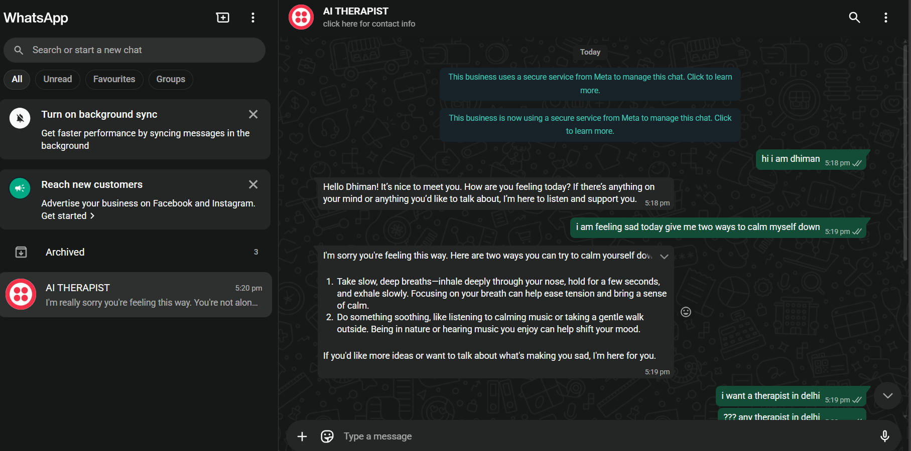
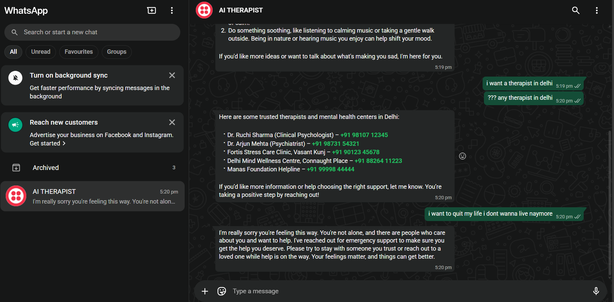

🌿 EmPath AI — AI-Powered Mental Health Therapist
Accessible • Empathetic • Safe • Always Available

Mental health support should be empathetic, responsible, and easy to reach.
EmPath AI is an AI system designed to provide emotional support, recognize distress, and safely escalate when someone might be in crisis — all while respecting privacy and responsible AI principles.

It is not a replacement for professional help,
but a supportive companion for moments when people feel alone and need someone to talk to.

 🚀 Understand The Working: 

 1) Link One: https://drive.google.com/file/d/13SI6v33GP6JE3SMJEBrN83iCPChUiOmn/view?usp=drive_link
 2) Link Two: https://drive.google.com/file/d/1nFgPfCYbVxMlQpevh0gwwSxNCxI6RJgm/view?usp=drive_link

📸 DEMO

  
  
  

🧭 Overview

EmPath AI combines:

🧠 Generative AI
💬 Emotion understanding
🧩 Tool-agent orchestration
🚨 Real-world crisis safety mechanisms
…to create a meaningful, empathetic, and accessible mental health assistant.

It consists of two major iterations:

🔵 Iteration 1 — Core Web App
✨ Features

✔️ Empathetic emotional conversations
Powered by MedGemma (Ollama) + GPT-4 tool agents for warm, human-like responses.

✔️ Recommends mental-health professionals
(Currently sample, Delhi-based — will integrate real APIs later.)

✔️ Detects stress, sadness & crisis-language
LLM + rule-based intent analysis.

✔️ Emergency escalation via Twilio Voice
Triggers a call to a pre-set emergency contact when required.

✔️ Privacy-first design
No conversation history stored.

✔️ Tool-agent architecture
Ensures safety, routing, and controlled reasoning.

✔️ Streamlit UI with TTS + STT
Speech-to-text & text-to-speech for accessibility.

🟢 Iteration 2 — WhatsApp AI Therapist

To make the system truly accessible, Iteration 2 brings the therapist directly to WhatsApp.

✨ New Additions

💬 Twilio WhatsApp Integration
Chat with the AI therapist directly — no app, no website.

🌐 ngrok Secure Tunneling
Enables real-time webhook communication with local FastAPI server.

🔁 End-to-End Messaging Pipeline
WhatsApp → Twilio → FastAPI → AI Model → WhatsApp Reply

⚡ Faster, more natural, private support
Ideal for real-life usage.

⚙️ Tech Stack

🖥️ Frontend
Streamlit (UI)
Python

🧩 Backend
FastAPI
Pydantic
Modular microservice-style service structure

🧠 AI Layer
MedGemma via Ollama
GPT-4 (tools + agent orchestration)

🔐 Safety & Tools
Intent & sentiment analysis
Crisis detection heuristics
Twilio Voice API
Emergency escalation
Agent-tool routing

🚀 Infra / DevOps
ngrok

Environment-based configuration

Local + external webhook orchestration
